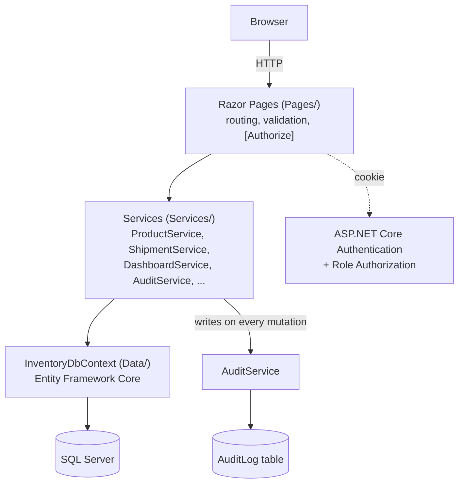
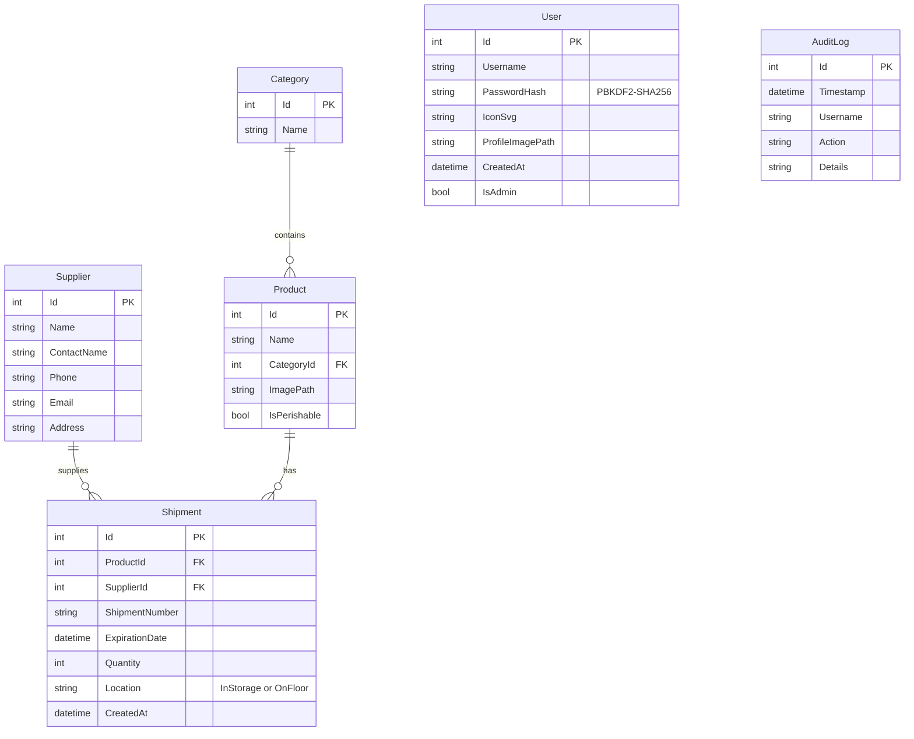

# Grocery Inventory Tracker

[](https://github.com/bayliss512/GroceryInventoryTracker/actions/workflows/ci.yml)

An ASP.NET Core Razor Pages application for tracking grocery store inventory — products, categories,
suppliers, and shipments — with role-based access control, a live dashboard, and a full audit trail of
who changed what. Built with Entity Framework Core against SQL Server, containerized with Docker, and
covered by a 91-test xUnit suite that runs in CI on every push.

## Overview

Employees can browse and search the product catalog, receive shipments, and update stock levels.
Administrators additionally manage products, categories, and suppliers; manage user accounts and
roles; and review a complete audit history of inventory and account changes. The dashboard surfaces
at-a-glance signals — out-of-stock and low-stock products, shipments expiring soon, and recent
activity — without anyone having to dig through the catalog manually.

## Features

- **Dashboard** — total product count, out-of-stock and low-stock counts (with the affected product
  names), shipments expiring within 7 days, and recent shipment/user activity, all computed with
  grouped queries (no N+1 lookups).
- **Inventory CRUD** — full create/edit/delete for Products, Categories, Suppliers, and Shipments, with
  server-side validation and a perishable flag per product.
- **Search, filter, and sort** — combinable search-by-name, category filter, supplier filter, and
  expiration-window filter on the catalog, with stable sort by name/quantity/expiration/recently-updated
  and pagination that preserves every active filter across pages.
- **Role-based access control** — Administrator and Employee roles enforced via
  `[Authorize(Roles = "...")]` on every page (see [Roles & Permissions](#roles--permissions) below), not
  just hidden nav links.
- **Audit log** — every product/category/supplier/shipment change and user promotion/demotion/deletion
  is recorded with who, what, and when, viewable on an Administrator-only Audit History page.
- **Accounts** — sign-up/login with salted, hashed passwords (PBKDF2-SHA256), a generated identicon or
  uploaded profile picture, and a settings page for changing either.
- **UI polish** — responsive layout, an inline SVG icon set (no external icon-font dependency),
  accessible confirmation modals in place of native `confirm()` dialogs, loading indicators, and shared
  empty-state messaging.
- **Automated tests** — 91 xUnit tests across services, authentication/authorization coverage, and
  database/migration correctness (see [Testing](#testing)).
- **Docker** — one-command startup via Docker Compose (app + SQL Server, with a persistent data volume).
- **CI/CD** — GitHub Actions pipeline: restore, build, test, publish, and a Docker image push to GHCR on
  every merge to `main`.

## Tech Stack

| Layer          | Technology                                              |
|----------------|----------------------------------------------------------|
| Framework      | ASP.NET Core (Razor Pages), .NET 10                      |
| ORM / Database | Entity Framework Core 10, SQL Server                     |
| Auth           | ASP.NET Core cookie authentication, role-based authorization |
| Frontend       | Razor views, Bootstrap, vanilla JavaScript, inline SVG icons |
| Testing        | xUnit, EF Core InMemory-via-Sqlite, a real SQL Server integration test |
| Containers     | Docker, Docker Compose                                   |
| CI/CD          | GitHub Actions (GHCR image publish)                      |

## Architecture

A conventional layered Razor Pages architecture: pages hold no business logic themselves, delegating to
a service layer that owns all EF Core access.



### Roles & Permissions

| Action                                   | Employee | Administrator |
|-------------------------------------------|:--------:|:-------------:|
| View catalog, search/filter/sort           | ✅       | ✅             |
| View dashboard                             | ✅       | ✅             |
| Receive shipments / update quantities      | ✅       | ✅             |
| Create/edit/delete Products                | ❌       | ✅             |
| Create/edit/delete Categories              | ❌       | ✅             |
| Create/edit/delete Suppliers               | ❌       | ✅             |
| Delete shipments                           | ❌       | ✅             |
| Manage user accounts / roles               | ❌       | ✅             |
| View audit history                         | ❌       | ✅             |
| Database Configuration page (dev tooling)  | ❌       | ✅             |

## Database Schema



`User` and `AuditLog` are intentionally not foreign-keyed to the rest of the schema — `AuditLog.Username`
records the actor by name so the audit trail survives account deletion.

## Screenshots

*Coming soon.* Views worth capturing once available: the Dashboard, the product catalog with an active
search/filter, a product's shipment detail view, the Audit History page, and the Admin user-management
page.

## Getting Started (local development)

### Prerequisites
- .NET 10 SDK
- SQL Server (Express, LocalDB, or a full instance)

### Setup

1. **Clone the repository**
   ```bash
   git clone https://github.com/bayliss512/GroceryInventoryTracker.git
   cd GroceryInventoryTracker
   ```

2. **Restore dependencies**
   ```bash
   dotnet restore
   ```

3. **Configure the connection string** in `GroceryInventoryTracker/appsettings.json` if your SQL Server
   instance differs from the default:
   ```json
   "ConnectionStrings": {
     "DefaultConnection": "Server=localhost\\SQLEXPRESS;Database=GroceryInventoryTracker;Trusted_Connection=True;MultipleActiveResultSets=true;TrustServerCertificate=True"
   }
   ```

4. **Run the application**
   ```bash
   dotnet run --project GroceryInventoryTracker
   ```
   On first run the app creates and seeds the database automatically (21 categories, 288 products, and
   sample shipments). You can also trigger this manually — or reset it — from the in-app Configuration
   page (Administrator-only).

   To manage schema changes explicitly instead, use EF Core migrations:
   ```bash
   dotnet ef database update -p GroceryInventoryTracker -s GroceryInventoryTracker
   ```
   or the bundled helper script (`GroceryInventoryTracker/update-database.ps1 -Action Update`).

5. **Access the application** at the URL shown in the console (e.g. `https://localhost:7266`), sign up
   for an account — the first account created is automatically made an Administrator — and explore the
   dashboard.

## Docker

The app and SQL Server both run in containers via Docker Compose, with SQL Server's data persisted in a
named volume so it survives `docker-compose down`.

1. **Set a SQL Server password**
   ```bash
   cp .env.example .env
   # then edit .env and set SA_PASSWORD to a strong password
   ```

2. **Start everything**
   ```bash
   docker-compose up --build
   ```
   Compose waits for SQL Server to actually accept logins (via a healthcheck) before starting the web
   container, so there's no manual coordination needed.

3. **Access the application** at `http://localhost:8080`.

The web container's connection string is supplied entirely through the `ConnectionStrings__DefaultConnection`
environment variable in `docker-compose.yml` — no code or `appsettings.json` changes are needed to switch
between local SQLEXPRESS and the containerized database.

## Testing

```bash
dotnet test GroceryInventoryTracker.slnx
```

91 tests covering:
- **Service logic** — Product, Category, Supplier, Shipment, User, Dashboard, and Audit services, against
  a real relational Sqlite in-memory database.
- **Authentication** — the claims issued at sign-in (username, role, icon/profile picture).
- **Authorization coverage** — a reflection-based test asserting every page still carries the exact
  `[Authorize]`/`[Authorize(Roles = ...)]` gate it's supposed to, so a future edit can't silently loosen
  access control.
- **Database/migrations** — that the current EF Core model has no pending changes against the latest
  migration, and that the real, on-disk migration files apply cleanly against a live SQL Server (this one
  test needs a real SQL Server instance — see [CI/CD](#cicd) for how that's handled without a local install).

## CI/CD

GitHub Actions (`.github/workflows/ci.yml`) runs on every push/PR to `main`:

1. **`build-and-test`** (runs on `windows-latest`, which ships with SQL Server Express pre-installed —
   the only way to run the full suite, including the live-SQL-Server migration test, without a separate
   database service) — restore → build → test → publish, with test results and the publish output
   uploaded as build artifacts.
2. **`docker-publish`** (on merges to `main` only) — builds the image from
   `GroceryInventoryTracker/Dockerfile` and pushes it to GitHub Container Registry
   (`ghcr.io/bayliss512/groceryinventorytracker`), tagged `latest` and with the commit SHA.

Auto-deploy beyond the GHCR image isn't wired up yet — see [Future Improvements](#future-improvements).

## Project Structure

```
GroceryInventoryTracker/
├── GroceryInventoryTracker/
│   ├── Models/              # Product, Category, Supplier, Shipment, User, AuditLog
│   ├── Data/                # InventoryDbContext and database configuration
│   ├── Services/            # Business logic (one service per entity, plus Dashboard/Audit/Auth helpers)
│   ├── Pages/                # Razor Pages and page models, organized per entity
│   ├── wwwroot/             # Static files (CSS, JavaScript, product images)
│   ├── Migrations/           # Entity Framework Core migrations
│   ├── Dockerfile
│   └── Properties/
├── GroceryInventoryTracker.Tests/   # xUnit test suite (services, auth, database)
├── .github/workflows/ci.yml         # CI/CD pipeline
├── docker-compose.yml
└── .env.example
```

## Future Improvements

- Auto-deploy the published GHCR image to a live host (e.g. Azure App Service, Fly.io) once a hosting
  target is chosen.
- Real screenshots of the running app in this README.
- A LICENSE file (none is currently included in the repository).
